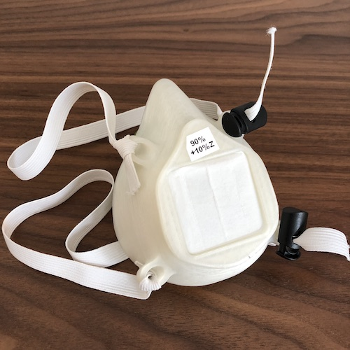
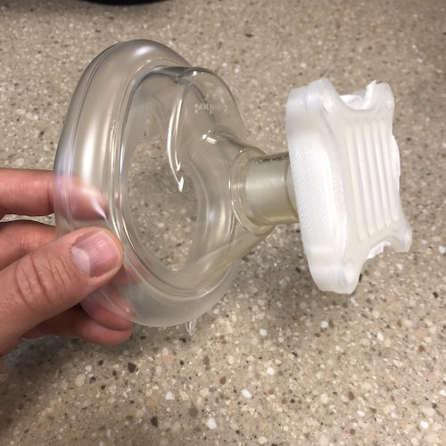

We are searching for a solution to supply N95 respirators to healthcare workers amid global supply chain shortages of the usual disposable masks, as well as shortages of traditional elastomeric respirators from large manufacturers.

This is our progress so far.

> None of this work is rigorously tested or verified to meet any standards for personal protection or filtration and should be considered experimental only.

# Montana Mask

This mask design is a slight modification of plans by [Spencer Zaugg](https://longliveyoursmile.com/3d-printable-mask-for-covid-19/) a dentist in Montana, who generously shared his designs. We have made it available in three sizes 83%, 90% and 100% that seem to accommodate a wide range of face shapes and sizes.

A version of this mask passed the standard N95 "smell test".

<a class="button" href="montana">Montana Mask Build Details</a>

# Resus Mask

This is a 3d-printed insert for a standard resuscitation mask. Though hospital supplies of these masks may be limited, resuscitation masks are [still](https://www.amazon.com/s?k=resuscitation+mask&crid=1MLUZIQX503S&sprefix=resusci%2Caps%2C202&ref=nb_sb_ss_i_1_7) [widely](https://www.redcross.org/store/training-supplies/cpr-masks-and-face-shields) [available](https://www.mcrmedical.com/BASK.html) from retail sellers (unlike elastomeric respirators that are difficult to find amidst the COVID-19 pandemic).

<a class="button" href="resus">Resus Mask Build Details</a>

# Filter Material

The masks use HEPA filter material.

<a class="button" href="filter">More on the filter</a>