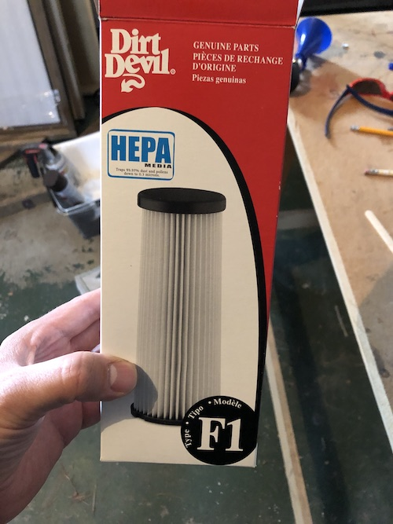
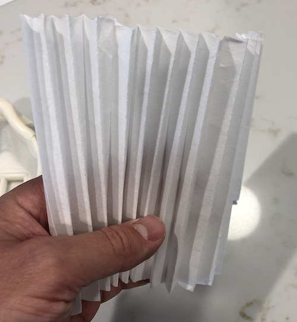

The masks use HEPA filter material. [HEPA filter material removes 99.97% (ASME, U.S. DOE) of particles whose diameter is equal to 0.3 μm](https://en.wikipedia.org/wiki/HEPA#cite_note-4) which makes it similar to P100 filters, [which exceed the 95% filtration of an N95 mask](https://www.cdc.gov/niosh/npptl/topics/respirators/disp_part/default.html) recommended by the CDC and WHO for protection from airborne transmission of COVID-19.

The filter material in these photos was taken from a vacuum filter readily available at a local home improvement store. HEPA material is available in a variety of form factors for various applications and is relatively inexpensive.

## Cut N95s or Filter Patches

[On his website](https://longliveyoursmile.com/3d-printable-mask-for-covid-19/), Dr. Zaugg recommends cutting up a single mask into 6 pieces or by ordering custom filter patches from [flowmarkhightech.com](https://www.flowmarkhightech.com/). We have not used the Flowmark/HighTech material.