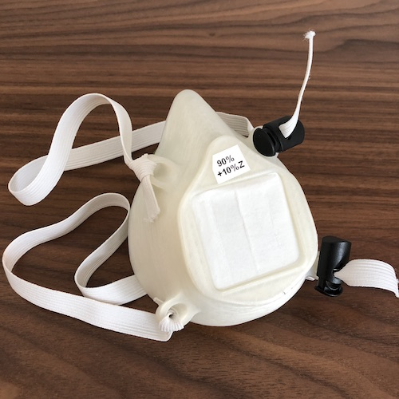
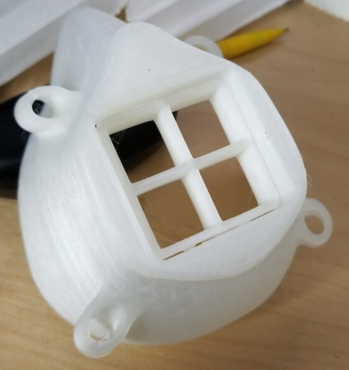
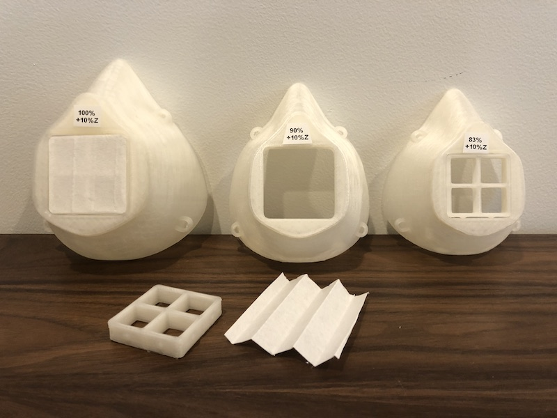
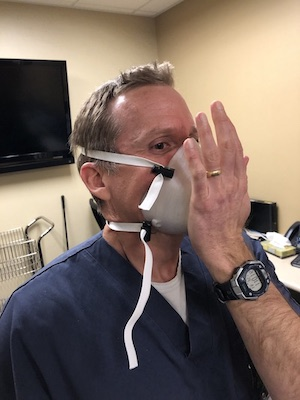
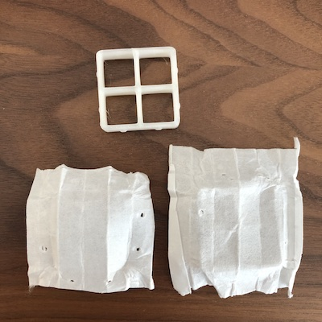
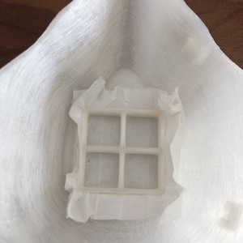
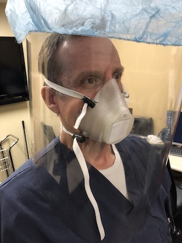
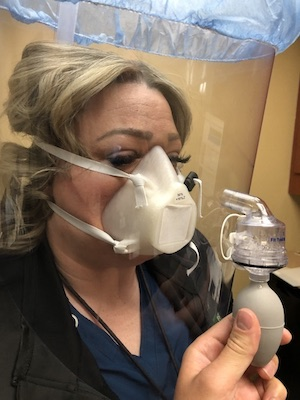
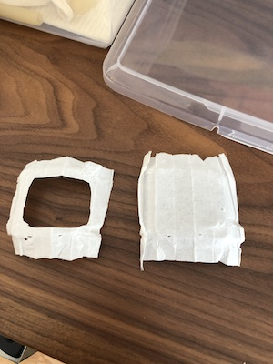

The first mask design a slight modification of plans by [Spencer Zaugg](https://longliveyoursmile.com/3d-printable-mask-for-covid-19/) a dentist in Montana, who generously shared his designs.

By stretching the original design *10% in the z-axis*, and printing at *100%, 90% and 83%* we have found the masks fit a wide variety of faces comfortably with a tight seal.

3D printing source files available at the [PLHAE website](http://www.plhae.com/montana-mask.php)

<a class="button" href="http://www.plhae.com/montana-mask.php">3D Printing Source Files</a>

# Mask Parts

Assembly is simple and is hopefully apparent from the photos.

1. 3D printed mask and filter insert
2. [HEPA filter material](filter)
3. Elastic band and 2 barrel toggle stops available at local craft or fabric store
4. Optionally could consider twill tape on each mask lug and tie behind head, though the elastic band makes a snug and mobile fit.

# Mask Sizing

The three sizes, 100%, 90% and 83% fit 19 out of 20 test nurses, techs and doctors in our local emergency department.

The 90% mask fit most people.

## Palm Occlusion

Finding the right size mask was done by having users put the mask on, adjust for smooth fit over nose and cheeks, and checked for seal under chin. 

Once a good initial fit was found, the filter area was occluded by the users palm and they inhaled gently. If they were unable to breathe in and no leaks were apparent around the edges, it was deemed a good fit.

# Filter Assembly

To obtain adequate seal around the filter insert, two layers of [HEPA filter material](./filter) were cut slightly larger than the insert on all sides and press fit into the mask.

# Fit Testing

3 different users underwent hospital protocol for N95 fit testing with the Montana masks. 1 user failed round one of the smell/taste test without a mask. The other 2 users passed the fit test with the Montana Mask.

# Challenges

The rigid mask material may be uncomfortable for long term use. We are pursuing more flexible material options. Additionally, more flexible material might make fitting a range of face shapes and sizes more feasible.

Also, the two layers of HEPA material are necessary to occlude the gaps around the filter insert, but make breathing difficult for long periods.

Our next step will be to cut a portion out of the top filter, so that the gaps are still occluded by two layers of filter material, but breathing is done through just one.

This approach has not yet been fit tested.

