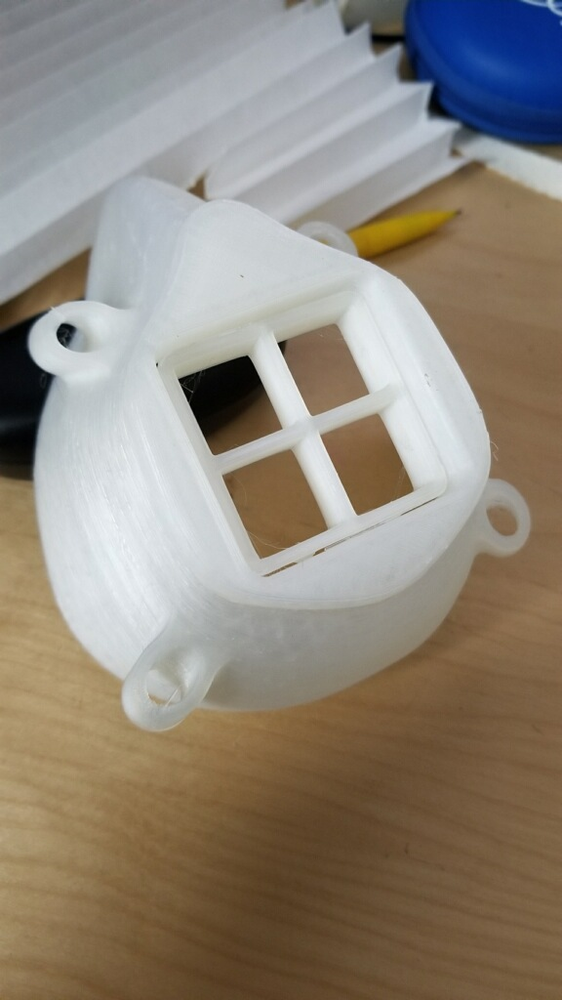

The first mask design a slight modification of plans by [Spencer Zaugg](https://longliveyoursmile.com/3d-printable-mask-for-covid-19/) a dentist in Montana, who generously shared his designs.

By stretching the original design *10% in the z-axis*, and printing at *100%, 90% and 83%* we have found the masks fit a wide variety of faces comfortably with a tight seal.

3D printing source files available at the [PLHAE website](http://www.plhae.com/montana-mask.php)

<a class="button" href="http://www.plhae.com/montana-mask.php">3D Printing Source Files</a>

