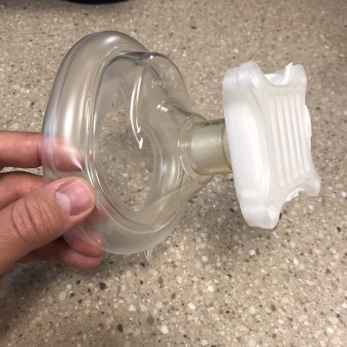

This is a 3d-printed insert for a standard resuscitation mask. Though hospital supplies of these masks may be limited, resuscitation masks are [still](https://www.amazon.com/s?k=resuscitation+mask&crid=1MLUZIQX503S&sprefix=resusci%2Caps%2C202&ref=nb_sb_ss_i_1_7) [widely](https://www.redcross.org/store/training-supplies/cpr-masks-and-face-shields) [available](https://www.mcrmedical.com/BASK.html) from retail sellers (unlike elastomeric respirators that are difficult to find amidst the COVID-19 pandemic).

<a class="button" href="http://www.plhae.com/montana-mask.php">3D Printing Source Files</a>

This has not been fit tested in any way as of yet.

